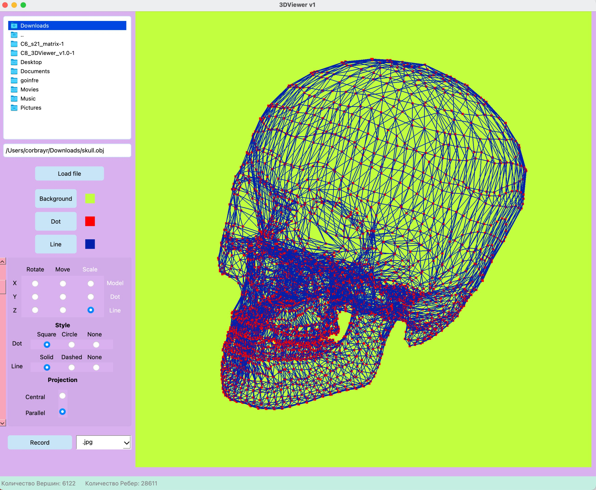

# 3DViewer_v1.0

* __В данном проекте была реализована на языке программирования Си программа для просмотра 3D моделей в каркасном виде (3D Viewer). Сами модели необходимо загружать из файлов формата .obj и иметь возможность просматривать их на экране с возможностью вращения, масштабирования и перемещения.__

## Information

Каркасная модель - модель объекта в трёхмерной графике, представляющая собой совокупность вершин и рёбер, которая определяет форму отображаемого многогранного объекта в трехмерном пространстве.

### Формат представления описаний трехмерных объектов .obj

Файлы .obj - это формат файла описания геометрии, впервые разработанный компанией Wavefront Technologies. Формат файла открыт и принят многими поставщиками приложений для 3D-графики.

Формат файла .obj - это простой формат данных, который представляет только трехмерную геометрию, а именно положение каждой вершины, положение UV координат текстуры каждой вершины, нормали вершин и грани, которые определяют каждый многоугольник как список вершин и вершин текстуры. Координаты obj не имеют единиц измерения, но файлы obj могут содержать информацию о масштабе в удобочитаемой строке комментариев.

Пример файла формата .obj:
```
  # Список вершин, с координатами (x, y, z[, w]), w является не обязательным и по умолчанию равен 1.0
  v 0.123 0.234 0.345 1.0
  v ...
  ...
  # Текстурные координаты (u, v[, w]), w является не обязательным и по умолчанию 0
  vt 0.500 -1.352 [0.234]
  vt ...
  ...
  # Нормали (x, y, z)
  vn 0.707 0.000 0.707
  vn ...
  ...
  # Параметры вершин в пространстве (u[, v][, w])
  vp 0.310000 3.210000 2.100000
  vp ...
  ...
  # Определения поверхности (сторон)
  f v1 v2 v3
  f ...
  ...
  # Группа
  g Group1
  ...
  # Объект
  o Object1
```

### Аффинные преобразования 

Аффинное преобразование - отображение плоскости или пространства в себя, при котором параллельные прямые переходят в параллельные прямые, пересекающиеся — в пересекающиеся, скрещивающиеся — в скрещивающиеся. \
Преобразование плоскости называется аффинным если оно взаимно однозначно и образом любой прямой является прямая. Преобразование (отображение) называется взаимно однозначным (биективным), если оно переводит разные точки в разные, и в каждую точку переходит какая-то точка.

С алгебраической точки зрения аффинное преобразование это преобразование вида: _f(x) = M * x + v_, где _M_ - некая обратимая матрица, а _v_ - какое-то значение.

Свойства аффинных преобразований:
- Композиция аффинных преобразований есть снова аффинное преобразование.
- Преобразование, обратное к аффинному, есть снова аффинное преобразование.
- Отношение площадей сохраняется.
- Отношение длин отрезков на прямой сохраняется.

#### Перемещение 

Матрица перемещения в однородных двумерных координатах:
```
1 0 a
0 1 b
0 0 1
```

где _a_ и _b_ - величины по _x_ и _y_, на которые необходимо переместить исходную точку. Таким образом, чтобы переместить точку необходимо умножить матрицу перемещения на нее:
```
x1     1 0 a     x 
y1  =  0 1 b  *  y
1      0 0 1     1
```

где _x_ и _y_ - исходные координаты точки, а _x1_ и _y1_ - полученные координаты новой точки после перемещения.

#### Поворот

Матрица поворота по часовой стрелке в однородных двумерных координатах:
```
cos(a)  sin(a) 0
-sin(a) cos(a) 0
0       0      1
```

где _a_ - угол поворота в двумерном пространстве. Для получения координат новой точки необходимо также, как и матрицу перемещения, перемножить матрицу поворота на исходную точку:
```
x1     cos(a)  sin(a) 0     x 
y1  =  -sin(a) cos(a) 0  *  y
1      0       0      1     1
```

#### Масштабирование

Матрица масштабирования в однородных двумерных координатах:
```
a 0 0
0 b 0
0 0 1
```

где _a_ и _b_ - коэффициенты масштабирования соответственно по осям OX и OY. Получение координат новой точки происходит аналогично описанным выше случаям.

## Руководство пользователя

### Загрузка объектного файла

Реализованы два варианта загрузки объектного файла:

1. В левом верхнем углу отображается файловый менеджер, который позволяет удобно с помощью графического интерфейса выбрать необходимый объектный файл. После выбора в поле ввода отображает результирующий путь до файла из корневой директори.

2. Также есть возможность прописать путь до файла самостоятельно в поле ввода, которое расположено ниже файлового менеджера

Далее необходимо нажать на кнопку "Load file" для последующей загрузки выбранного файла в программу. В поле справа будет выведен результат вывода 3D-модели, геометрия которой прописана в загруженном ранее файле.

### Работа с цветом

При первом выводе программа выводит модель в цветах, заданных по умолчанию. Но помимо этого реализована возможность замены цветов.

При нажатии на следующие кнопки открывается модальное окно с цветовым кругом, на котором есть возможность задать цвет фону, точкам вершин, линиям, соединяющим точки:

* кнопка "Background" - выбор цвета фона;
* кнопка "Dot" - выбор цвета точек;
* кнопка "Line" - выбор цвета линий, соединяющих точки.

Справа от кнопок отображается текущий выбранный цвет.

### Вращение, смещение и изменение масштаба модели

Слева от таблицы по вертикали отображены значения строк, x, y, z, а сверху по горизонтали значения столбцов "Rotate" (рус. вращение), "Move" (рус. перемещение), "Scale" (рус. масштаб). С помощью активации чекбокса в соответствующих колонке и столбце таблицы и перемещении ползунка реализована возможность вращения модели вокруг выбранной оси, смещение относительно центра окна просмотра, изменение масштаба.

### Изменение параметров видимости точек

Слева от таблицы по вертикали отображено значение строк, "Dot" (рус. точки), а сверху по горизонтали значения столбцов "Square" (рус. квадрат), "Circle" (рус. круг), "None" (рус. ничто). С помощью активации чекбокса в соответствующем столбце таблицы реализована возможность изменения вида отображаемых точек (в виде квадратов, кругов и позрачных точек).

### Изменение параметров видимости линий соединения точей

Слева от таблицы по вертикали отображены значение строк, "Line" (рус. линии), а сверху по горизонтали значения столбцов "Solid" (рус. сплошной), "Dashed" (рус. пунктирный), "None" (рус. ничто). С помощью активации чекбокса в соответствующем столбце таблицы реализована возможность изменения вида отображаемых линий (в виде сплошных линий, пунктирных и позрачных).

### Настройки типа проекции 

С помощью активации необходимого чекбокса, "Central" (рус. центральная) или "Parallel" (рус. параллельная), программа позволяет настраивать тип проекции.

### Запись

Программа позволяет сохранять полученные ("отрендеренные") изображения в файл в форматах bmp и jpeg, а также записывать небольшие "скринкасты" - текущие пользовательские аффинные преобразования загруженного объекта в gif-анимацию (640x480, 10fps, 5s).  Для этого необходимо выбрать в выпадающем меню желаемый формат файла, а затем нажать на кнопку "Record" (рус. запись) слева от меню.

